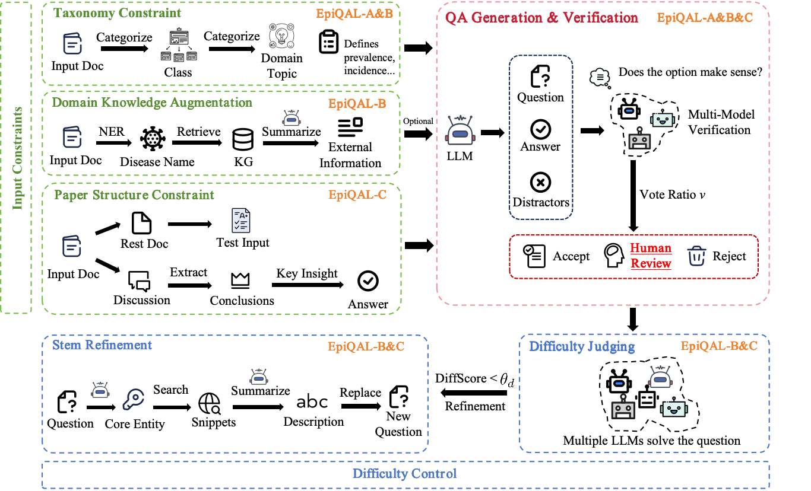

# EpiQAL: Benchmarking Large Language Models in Epidemiological Question Answering and Reasoning

EpiQAL is a diagnostic benchmark for epidemiological question answering over research articles. It tests whether LLMs can retrieve facts, chain multiple findings into inferences, and reconstruct study conclusions from incomplete information.

The benchmark has three subsets (A, B, C) built from PLOS Neglected Tropical Diseases articles. Each subset isolates a different reasoning skill and is constructed through a pipeline that pairs multi-model verification with difficulty screening. This repo contains the benchmark data, the full construction pipeline, and all evaluation scripts.



*Figure 1: Overall framework for EpiQAL construction.*

---

## Benchmark Overview

| | EpiQAL-A | EpiQAL-B | EpiQAL-C |
|---|---|---|---|
| **Core Capability** | Factual recall | Multi-step inference | Conclusion reconstruction |
| **Knowledge Source** | Document | Document | Article body (Discussion masked) |
| **Taxonomy Guided** | Yes | Yes | No |
| **External Knowledge** | No | Generation only | No |
| **Test Input** | Full document | Full document | Document w/o Discussion |
| **Difficulty Control** | No | Yes | Yes |

### Dataset Statistics

| | EpiQAL-A | EpiQAL-B | EpiQAL-C |
|---|---|---|---|
| Samples | 475 | 478 | 479 |
| Avg. #Options | 3.21 | 4.91 | 4.73 |
| Avg. #Correct | 1.19 | 1.00 | 1.00 |

EpiQAL-A admits multiple correct options per question. EpiQAL-B and EpiQAL-C are single-answer.

### Evaluation Metrics

- **F1** = 2|O_c ∩ A| / (|O_c| + |A|) — rewards partial overlap
- **EM** = 1[A = O_c] — requires exact set recovery

---

## Main Results

EM|F1 across subsets under zero-shot settings:

| Model | EpiQAL-A (w/o CoT) | EpiQAL-A (CoT) | EpiQAL-B (w/o CoT) | EpiQAL-B (CoT) | EpiQAL-C (w/o CoT) | EpiQAL-C (CoT) |
|---|---|---|---|---|---|---|
| GPT-5-mini | 0.905\|0.966 | 0.924\|0.966 | 0.533\|0.788 | 0.634\|0.827 | 0.599\|0.789 | 0.555\|0.762 |
| GPT-4o-mini | 0.766\|0.904 | 0.796\|0.913 | 0.222\|0.650 | 0.531\|0.760 | 0.213\|0.655 | 0.236\|0.661 |
| GPT-4.1-nano | 0.768\|0.855 | 0.792\|0.868 | 0.678\|0.809 | 0.642\|0.789 | 0.559\|0.791 | 0.553\|0.780 |
| DeepSeek-V3.2-Thinking | **0.928**\|0.970 | 0.928\|0.969 | **0.818**\|0.896 | **0.868**\|0.909 | 0.720\|0.804 | 0.716\|0.822 |
| DeepSeek-V4-Flash-Thinking | 0.926\|0.971 | **0.935**\|0.970 | 0.703\|0.841 | 0.795\|0.862 | 0.666\|0.785 | 0.697\|0.794 |
| Phi-4-mini-instruct | 0.583\|0.811 | 0.657\|0.819 | 0.249\|0.678 | 0.406\|0.736 | 0.426\|0.755 | 0.388\|0.744 |
| Llama-3.2-3B | 0.366\|0.553 | 0.339\|0.473 | 0.157\|0.511 | 0.100\|0.259 | 0.088\|0.375 | 0.113\|0.366 |
| Llama-3.1-8B | 0.798\|0.911 | 0.834\|0.920 | 0.318\|0.670 | 0.665\|0.799 | 0.190\|0.592 | 0.384\|0.708 |
| Llama-3.3-70B | 0.779\|0.884 | 0.789\|0.890 | 0.651\|0.825 | 0.732\|0.855 | 0.580\|0.805 | 0.626\|0.827 |
| Mistral-7B | 0.722\|0.809 | 0.709\|0.799 | 0.789\|0.808 | 0.812\|0.814 | **0.808**\|0.822 | **0.812**\|0.816 |
| Mistral-Large | 0.901\|0.956 | 0.916\|0.960 | 0.644\|0.844 | 0.688\|0.853 | 0.685\|0.856 | 0.699\|0.856 |
| Qwen3-8B | 0.811\|0.921 | 0.840\|0.929 | 0.508\|0.763 | 0.619\|0.816 | 0.484\|0.752 | 0.514\|0.768 |
| Qwen3-30B-A3B | 0.882\|0.956 | 0.899\|0.964 | 0.573\|0.807 | 0.747\|0.873 | 0.585\|0.807 | 0.622\|0.826 |
| Qwen3-32B | 0.872\|0.949 | 0.857\|0.943 | 0.743\|0.864 | 0.736\|0.853 | 0.547\|0.783 | 0.557\|0.779 |
| GLM-4.5-Air | 0.874\|0.947 | 0.884\|0.953 | 0.657\|0.836 | 0.655\|0.835 | 0.580\|0.782 | 0.572\|0.733 |

**Bold** = best EM per column.

### Key Findings

- **Multi-step inference is the hardest subset.** Only 4 of 15 models exceed 0.70 EM on EpiQAL-B without CoT.
- **Rankings shift across subsets.** DeepSeek-V3.2-Thinking leads on A and B, but Mistral-7B leads on C with a fraction of the parameters.
- **Scale is not everything.** Mistral-7B beats Mistral-Large on both B (0.789 vs. 0.644) and C (0.808 vs. 0.685).
- **CoT helps inference, hurts elsewhere.** Largest gains on EpiQAL-B (e.g. Llama-3.1-8B: +0.347), but GPT-5-mini degrades on EpiQAL-C (0.599 → 0.555).

---

## Repository Layout

```
├── EpiQAL-A/                    # Factual recall
│   ├── EpiQAL-A.json            # Final benchmark (extracted from 0_shot/output/final_qa.json)
│   ├── 0_shot/                  # Construction pipeline + zero-shot evaluation
│   │   ├── main.py
│   │   ├── scripts/
│   │   └── output/
│   └── 1_shot/                  # One-shot evaluation (noCOT + COT)
│       └── scripts/
│
├── EpiQAL-B/                    # Multi-step inference (+ KG, difficulty control)
│   ├── EpiQAL-B.json
│   ├── 0_shot/
│   └── 1_shot/
│
├── EpiQAL-C/                    # Conclusion reconstruction (+ difficulty control)
│   ├── EpiQAL-C.json
│   ├── 0_shot/
│   └── 1_shot/
│
├── EpiQAL-OOD/                  # OOD evaluation on 96 post-release PLOS NTD articles
│   └── {A,B,C}/                 # Generated datasets + evaluation outputs (no separate code)
│
├── EpiQAL-IJE/                  # Cross-source evaluation on 82 IJE articles
│   └── {A,B,C}/
│
├── KG/                          # Knowledge graphs (EpiQAL-B only)
│   ├── eKG-DONs/                # Disease Outbreak News KG + SapBERT embeddings
│   └── ibkh/                    # Integrated Biomedical Knowledge Hub
│
├── PLOS_ntds_new/               # Source corpus (~10,600 PLOS NTD articles, CC BY 4.0)
└── IJE/                         # Source corpus (82 IJE articles)
```

`EpiQAL-A.json` / `EpiQAL-B.json` / `EpiQAL-C.json` are the released benchmark files, identical in content to the corresponding `0_shot/output/final_qa.json` but placed at the root of each variant for convenience.

---

## Construction Pipeline

### EpiQAL-A (Factual Recall)

Classification → Topic Selection → Question Generation → Correct Option Generation → Distractor Generation → Multi-model Verification → Option Selection

### EpiQAL-B (Multi-step Inference)

Disease NER → KG Entity Alignment → External Knowledge Summarization → Classification → Topic Selection → Question Generation → Correct/Distractor Generation → Multi-model Verification → Option Selection → **Difficulty Judging → Stem Refinement**

### EpiQAL-C (Conclusion Reconstruction)

Correct Option Extraction (from Discussion) → Question Generation (option-conditioned) → Distractor Generation → Multi-model Verification → Option Selection → **Difficulty Judging → Stem Refinement**

### Multi-model Verification

Three checkers from different families (GPT-5-mini, DeepSeek-V3.2-Thinking, GLM-4.5-Air), each running 3 times at temperature 1.0 → 9 total votes per option. Thresholds: ≥6 accept, <5 reject, =5 human review.

### Difficulty Control (B & C only)

A four-model pool (GPT-5-mini, DeepSeek-V3.2-Thinking, Qwen3-32B, Phi-4-mini) estimates DiffScore = 1 − (α·F1 + (1−α)·EM) with α=0.3. Items below θ_d=0.2 undergo stem refinement: salient entities are replaced with web-retrieved descriptive phrases, up to 3 iterations.

---

## Quick Start

### 1. Install

```bash
pip install vllm torch transformers openai gliner faiss-cpu pydantic numpy matplotlib tqdm natsort requests bitsandbytes
```

Python 3.10, CUDA required for local models via vLLM.

### 2. Configure

Fill in API keys and paths in each `constant.py` you plan to use:

```python
OPENAI_API_KEY            = "<your-key>"
DPSK_API_KEY              = "<your-key>"
DEFINITION_SEARCH_API_KEY = "<your-key>"      # Serper, for stem refinement (B/C)
DATA_PATH                 = "<path-to-corpus>"
EKGDONS_FILE_PATH         = "<path-to-KG/eKG-DONs>"
IBKH_FILE_PATH            = "<path-to-KG/ibkh>"  # B only
```

### 3. Build the benchmark

```bash
cd EpiQAL-B/0_shot && python main.py
```

Each stage writes to `output/tmp/` and can be re-run independently by toggling the corresponding block in `main.py`.

### 4. Evaluate

Zero-shot (main results in Table 4):

```bash
cd EpiQAL-B/0_shot
python scripts/evaluation.py
```

One-shot (Appendix F.4):

```bash
cd EpiQAL-B/1_shot
python scripts/evaluation_noCOT.py
python scripts/evaluation_COT.py
```

Results land in `output/evaluation/{noCOT,COT}/scores.json`.

### Reproducing Appendix Experiments

| Experiment | How |
|---|---|
| Temperature ablation (F.7) | Set temperature to 0 in `constant.py`, re-run evaluation |
| Multi-run stability (F.8) | Run evaluation 3 times at the same settings |
| Question-only baseline (F.6) | Remove the document field from the evaluation input |
| OOD evaluation (F.9) | Use pre-built data in `EpiQAL-OOD/`, or re-run the pipeline on post-release articles |
| Cross-source evaluation (F.10) | Use pre-built data in `EpiQAL-IJE/`, or point `DATA_PATH` to `IJE/` and re-run |

---

## Models

### Pipeline

| Role | Models |
|---|---|
| Generation | Qwen3-30B-A3B-Instruct-2507 |
| Verification (checking) | GPT-5-mini, DeepSeek-V3.2-Thinking, GLM-4.5-Air |
| Difficulty judging | GPT-5-mini, DeepSeek-V3.2-Thinking, Qwen3-32B, Phi-4-mini-instruct |
| Disease NER (B only) | GLiNER (urchade/gliner_large-v2.1) |
| Entity alignment (B only) | SapBERT (cambridgeltl/SapBERT-from-PubMedBERT-fulltext) |

### Evaluation (15 models)

OpenAI: GPT-5-mini, GPT-4o-mini, GPT-4.1-nano · DeepSeek: V3.2-Thinking, V4-Flash-Thinking · Microsoft: Phi-4-mini-instruct · Meta: Llama-3.2-3B, 3.1-8B, 3.3-70B · Mistral AI: Mistral-7B, Mistral-Large · Alibaba: Qwen3-8B, Qwen3-30B-A3B, Qwen3-32B · Zhipu AI: GLM-4.5-Air

---

## Analysis Tools

Each variant ships with offline analysis scripts under `0_shot/scripts/tools/`:

| Script | What it does |
|---|---|
| `analysis.py` | Plot class/topic distributions |
| `adjust_diff_score.py` | Recompute DiffScore with a different α |
| `diff_selection.py` | Compare difficulty distributions across revision iterations |
| `review_options.py` | Package borderline options for human review |
| `cate_distractors.py` | Classify distractors by error type (via GPT-5-mini) |
| `distractor_analysis.py` | Per-model deception rates |
| `human_evaluation.py` | Stratified sampling for human annotators |
| `human_analysis.py` | Inter-annotator agreement |

---

## Output Structure

```
EpiQAL-{A,B,C}/0_shot/output/
├── input_para.json                # 500 sampled source paragraphs
├── final_qa.json                  # Finalized QA benchmark
├── final_results.json             # Full provenance per instance
└── tmp/
    ├── classes.json, topics.json  # A/B only
    ├── external_info.json         # B only
    ├── kg/relevant_triples.json   # B only
    ├── questions.json
    ├── option/                    # correct_options.json, distractors.json
    ├── coherence/                 # checking results + review_options
    ├── selected_options.json
    ├── diff_judge/                # B/C: difficulty scores per iteration
    └── revision/                  # B/C: revised stems per iteration
```

---

## Source Corpora

- **PLOS Neglected Tropical Diseases** (~10,600 articles, CC BY 4.0) — viral, parasitic, bacterial, and fungal pathogens. 500 randomly sampled articles for the main benchmark.
- **International Journal of Epidemiology** (82 articles) — chronic and environmental epidemiology. Used for cross-source generalization (Appendix F.10).

## License

PLOS NTD source articles are [CC BY 4.0](https://creativecommons.org/licenses/by/4.0/). The benchmark dataset and code inherit this license.
